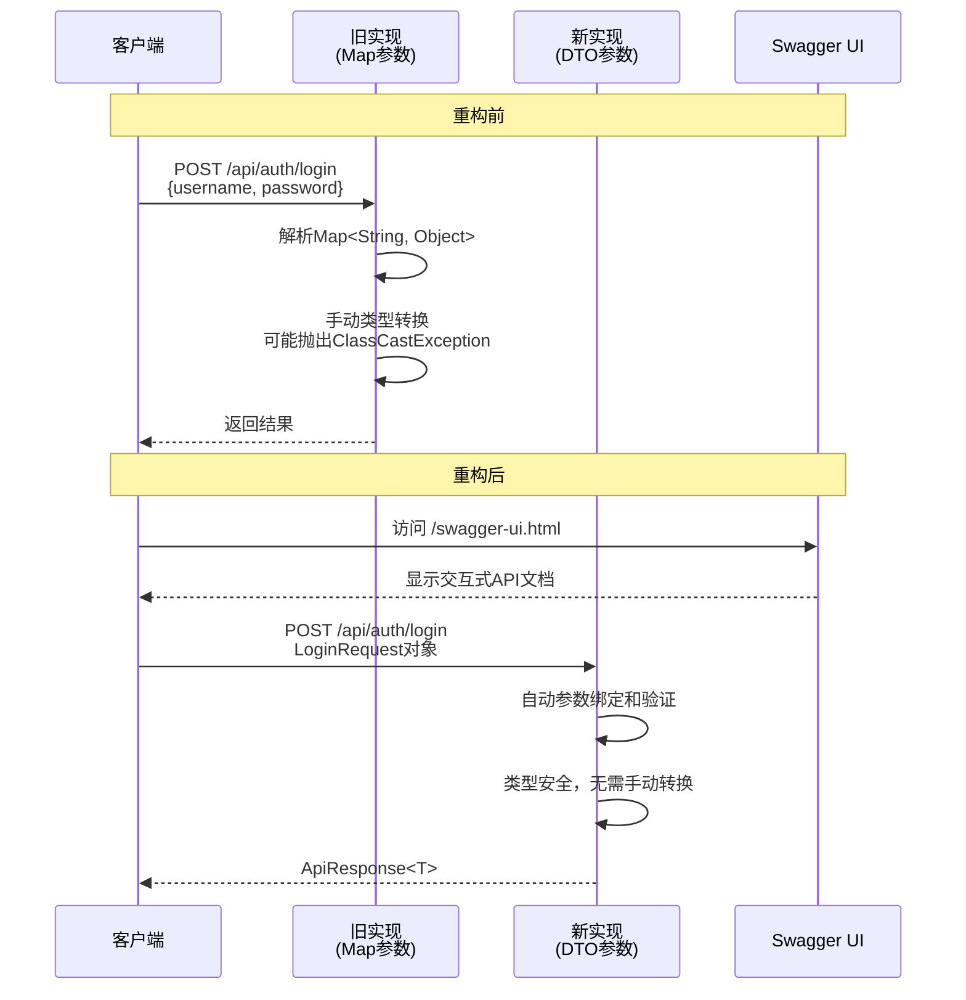

## 1. 高级摘要（TL;DR）

- **影响：** 🟡 **中等** - 对影院订票系统进行了全面的API文档化改造，并重构了所有Controller的请求参数
- **关键变更：**
  - ✅ 添加 **SpringDoc OpenAPI** 依赖和配置，启用Swagger UI文档
  - ✅ 新增 **14个强类型DTO Request类**，替换原有的 `Map<String, Object>` 参数
  - ✅ 新增 **3个DTO Response类**，统一API响应格式
  - ✅ 为所有 **7个Controller** 添加完整的Swagger注解（@Tag、@Operation、@ApiResponses等）
  - ✅ 更新测试文档，添加详细的测试用例表格和可视化图表

***

## 2. 可视化概览（代码与逻辑映射）

### API文档化架构图

```mermaid
graph TD
    subgraph "配置层"
        A1["pom.xml<br/>添加 springdoc-openapi-ui 依赖"]
        A2["OpenApiConfig.java<br/>配置Swagger UI和JWT认证"]
    end
    
    subgraph "DTO层 - 请求对象"
        B1["LoginRequest"]
        B2["RegisterRequest"]
        B3["CreateBookingRequest"]
        B4["ChangeTicketRequest"]
        B5["PayBookingRequest"]
        B6["CancelBookingRequest"]
        B7["CreateReviewRequest"]
        B8["ApplyCouponRequest"]
        B9["ChangePasswordRequest"]
        B10["RealNameAuthRequest"]
        B11["RedeemPointsRequest"]
        B12["UpdateProfileRequest"]
        B13["UpdateUserRequest"]
        B14["AddAnnouncementRequest"]
    end
    
    subgraph "DTO层 - 响应对象"
        C1["ApiResponse<T><br/>通用响应"]
        C2["BookingResponse<br/>订单响应"]
        C3["UserResponse<br/>用户响应"]
    end
    
    subgraph "Controller层"
        D1["AdminController<br/>管理员接口"]
        D2["AuthController<br/>认证接口"]
        D3["BookingController<br/>订单接口"]
        D4["CouponController<br/>优惠券接口"]
        D5["MovieController<br/>电影接口"]
        D6["ReviewController<br/>评论接口"]
        D7["UserController<br/>用户接口"]
    end
    
    A1 --> A2
    A2 --> D1
    A2 --> D2
    A2 --> D3
    A2 --> D4
    A2 --> D5
    A2 --> D6
    A2 --> D7
    
    B1 --> D2
    B2 --> D2
    B3 --> D3
    B4 --> D3
    B5 --> D3
    B6 --> D3
    B7 --> D6
    B8 --> D4
    B9 --> D7
    B10 --> D7
    B11 --> D7
    B12 --> D7
    B13 --> D1
    B14 --> D1
    
    D1 --> C1
    D2 --> C1
    D3 --> C2
    D6 --> C1
    D7 --> C3
    
    style A1 fill:#bbdefb,color:#0d47a1
    style A2 fill:#bbdefb,color:#0d47a1
    style B1 fill:#fff3e0,color:#e65100
    style B2 fill:#fff3e0,color:#e65100
    style B3 fill:#fff3e0,color:#e65100
    style B4 fill:#fff3e0,color:#e65100
    style B5 fill:#fff3e0,color:#e65100
    style B6 fill:#fff3e0,color:#e65100
    style B7 fill:#fff3e0,color:#e65100
    style B8 fill:#fff3e0,color:#e65100
    style B9 fill:#fff3e0,color:#e65100
    style B10 fill:#fff3e0,color:#e65100
    style B11 fill:#fff3e0,color:#e65100
    style B12 fill:#fff3e0,color:#e65100
    style B13 fill:#fff3e0,color:#e65100
    style B14 fill:#fff3e0,color:#e65100
    style C1 fill:#c8e6c9,color:#1a5e20
    style C2 fill:#c8e6c9,color:#1a5e20
    style C3 fill:#c8e6c9,color:#1a5e20
    style D1 fill:#f3e5f5,color:#7b1fa2
    style D2 fill:#f3e5f5,color:#7b1fa2
    style D3 fill:#f3e5f5,color:#7b1fa2
    style D4 fill:#f3e5f5,color:#7b1fa2
    style D5 fill:#f3e5f5,color:#7b1fa2
    style D6 fill:#f3e5f5,color:#7b1fa2
    style D7 fill:#f3e5f5,color:#7b1fa2
```



### 请求处理流程对比



***

## 3. 详细变更分析

### 📦 3.1 依赖配置变更

#### pom.xml 新增依赖

| 依赖                     | 版本     | 作用范围    | 说明                           |
| :--------------------- | :----- | :------ | :--------------------------- |
| `springdoc-openapi-ui` | 1.6.15 | compile | 提供Swagger UI和OpenAPI 3.0文档支持 |

**影响：** 启动应用后可访问 `/swagger-ui.html` 查看交互式API文档

***

### ⚙️ 3.2 新增配置类

#### OpenApiConfig.java

**文件路径：** `src/main/java/com/cinema/config/OpenApiConfig.java`

**配置要点：**

| 配置项   | 值              | 说明      |
| :---- | :------------- | :------ |
| API标题 | "影院在线订票系统 API" | 系统名称    |
| API版本 | "1.0.0"        | 版本号     |
| 安全方案  | Bearer JWT     | 使用JWT认证 |
| 许可证   | MIT License    | 开源协议    |

**关键代码：**

```java
@Bean
public OpenAPI customOpenAPI() {
    final String securitySchemeName = "bearerAuth";
    return new OpenAPI()
        .info(new Info()
            .title("影院在线订票系统 API")
            .version("1.0.0")
            .description("影院在线订票系统后端接口文档..."))
        .addSecurityItem(new SecurityRequirement().addList(securitySchemeName))
        .components(new io.swagger.v3.oas.models.Components()
            .addSecuritySchemes(securitySchemeName,
                new SecurityScheme()
                    .type(SecurityScheme.Type.HTTP)
                    .scheme("bearer")
                    .bearerFormat("JWT")));
}
```

***

### 📝 3.3 Controller层变更

所有Controller都添加了完整的Swagger注解，并将 `Map<String, Object>` 参数替换为强类型DTO。

#### 变更对比示例

**旧实现（AuthController.java）：**

```java
@PostMapping("/register")
public Map<String, Object> register(@RequestBody Map<String, Object> body) {
    String username = (String) body.get("username");
    String password = (String) body.get("password");
    String phone = (String) body.get("phone");
    return userService.register(username, password, phone);
}
```

**新实现：**

```java
@PostMapping("/register")
@Operation(summary = "用户注册", description = "创建新用户账户")
@ApiResponses(value = {
    @ApiResponse(responseCode = "200", description = "注册成功",
        content = @Content(mediaType = "application/json",
            examples = @ExampleObject(
                name = "成功",
                value = "{\"success\":true,\"message\":\"注册成功\",...}"))),
    @ApiResponse(responseCode = "200", description = "用户名已存在",
        content = @Content(mediaType = "application/json",
            examples = @ExampleObject(
                name = "失败",
                value = "{\"success\":false,\"message\":\"用户名已存在\",...}")))
})
public Map<String, Object> register(@RequestBody RegisterRequest request) {
    return userService.register(request.getUsername(), request.getPassword(), request.getPhone());
}
```

#### Controller注解统计

| Controller        | @Tag  | @Operation数量 | 参数类型变更     |
| :---------------- | :---- | :----------- | :--------- |
| AdminController   | 管理员管理 | 17           | Map → DTO  |
| AuthController    | 用户认证  | 2            | Map → DTO  |
| BookingController | 订单管理  | 7            | Map → DTO  |
| CouponController  | 优惠券管理 | 4            | Map → DTO  |
| MovieController   | 电影管理  | 2            | 无变更（GET请求） |
| ReviewController  | 评论管理  | 4            | Map → DTO  |
| UserController    | 用户管理  | 6            | Map → DTO  |

***

### 📦 3.4 新增DTO Request类

#### 完整列表

| 类名                         | 字段数 | 用途        | 对应接口                           |
| :------------------------- | :-- | :-------- | :----------------------------- |
| **LoginRequest**           | 2   | 用户登录      | POST /api/auth/login           |
| **RegisterRequest**        | 3   | 用户注册      | POST /api/auth/register        |
| **CreateBookingRequest**   | 5   | 创建订单      | POST /api/bookings             |
| **ChangeTicketRequest**    | 3   | 改签        | POST /api/bookings/change      |
| **PayBookingRequest**      | 2   | 支付        | POST /api/bookings/pay         |
| **CancelBookingRequest**   | 1   | 取消订单      | POST /api/bookings/cancel      |
| **CreateReviewRequest**    | 3   | 创建评论      | POST /api/reviews              |
| **ApplyCouponRequest**     | 2   | 应用优惠券     | POST /api/coupons/apply        |
| **ChangePasswordRequest**  | 2   | 修改密码      | POST /api/user/change-password |
| **RealNameAuthRequest**    | 2   | 实名认证      | POST /api/user/real-name-auth  |
| **RedeemPointsRequest**    | 1   | 积分兑换      | POST /api/user/redeem-points   |
| **UpdateProfileRequest**   | 3   | 更新资料      | PUT /api/user/profile          |
| **UpdateUserRequest**      | 3   | 更新用户（管理员） | PUT /api/admin/users/{id}      |
| **AddAnnouncementRequest** | 2   | 添加公告      | POST /api/admin/announcements  |

#### 示例：CreateBookingRequest

```java
@Schema(description = "创建订单请求")
public class CreateBookingRequest {
    @Schema(description = "场次ID", required = true)
    private Long showtimeId;
    
    @Schema(description = "座位ID列表", required = true)
    private List<Long> seatIds;
    
    @Schema(description = "用户姓名", required = true)
    private String userName;
    
    @Schema(description = "用户手机号", required = true)
    private String userPhone;
    
    @Schema(description = "零食JSON数据")
    private String snacksJson;
    
    // getters and setters...
}
```

***

### 📦 3.5 新增DTO Response类

#### ApiResponse<T> - 通用响应

```java
@Schema(description = "通用 API 响应")
public class ApiResponse<T> {
    @Schema(description = "是否成功", example = "true")
    private boolean success;
    
    @Schema(description = "消息", example = "操作成功")
    private String message;
    
    @Schema(description = "数据")
    private T data;
    
    public static <T> ApiResponse<T> success(T data) {
        return new ApiResponse<>(true, "操作成功", data);
    }
    
    public static <T> ApiResponse<T> error(String message) {
        return new ApiResponse<>(false, message, null);
    }
}
```

#### BookingResponse - 订单响应

包含订单的所有详细信息（订单号、电影信息、座位信息、金额、状态等）

#### UserResponse - 用户响应

包含用户的所有信息（ID、用户名、昵称、手机号、角色、会员等级、积分等）

***

### 📚 3.6 测试文档更新

#### TESTING\_GUIDE.md 主要变更

| 变更类型 | 内容                       |
| :--- | :----------------------- |
| 格式优化 | 所有表格使用Markdown标准格式，添加分隔线 |
| 新增内容 | 添加高级摘要（TL;DR）部分          |
| 新增内容 | 添加可视化概览（Mermaid图表）       |
| 新增内容 | 添加详细的依赖配置表格              |
| 新增内容 | 添加完整的测试用例表格              |
| 新增内容 | 添加测试架构流程图                |

***

## 4. 影响与风险评估

### ✅ 优势

1. **类型安全** - 从 `Map<String, Object>` 改为强类型DTO，编译时即可发现类型错误
2. **自动文档生成** - Swagger自动生成API文档，减少文档维护成本
3. **代码可读性提升** - DTO类清晰定义了接口的输入输出结构
4. **便于测试** - 强类型对象更容易编写单元测试
5. **交互式API测试** - Swagger UI提供在线测试界面

### ⚠️ 破坏性变更

| 变更类型        | 影响范围         | 说明                  |
| :---------- | :----------- | :------------------ |
| **API签名变更** | 所有POST/PUT接口 | 请求体从Map变为具体DTO对象    |
| **前端适配**    | 需要更新         | 前端调用方式不变，但需要确保字段名匹配 |
| **类型转换**    | 内部逻辑         | 移除了手动类型转换代码         |

**注意：** 虽然请求体结构从 `Map` 变为 `DTO`，但JSON字段名保持不变，因此**前端代码无需修改**，只需确保后端编译通过即可。

### 🧪 测试建议

1. **Swagger UI测试**
   - 访问 `http://localhost:8080/swagger-ui.html`
   - 验证所有接口文档是否正确显示
   - 使用"Try it out"功能测试每个接口
2. **接口兼容性测试**
   - 验证前端调用所有接口是否正常
   - 检查字段映射是否正确
3. **边界条件测试**
   - 测试DTO验证注解（如有添加）
   - 测试必填字段缺失的情况
4. **文档完整性检查**
   - 确认所有接口都有 `@Operation` 注解
   - 确认响应示例完整且准确

***

## 5. 总结

本次变更是一次**代码质量提升**和**API文档化**的重构工作：

- **核心目标**：将项目从"无文档、弱类型"状态提升到"有文档、强类型"状态
- **技术手段**：引入SpringDoc OpenAPI + 创建完整的DTO体系
- **影响范围**：所有Controller层接口（约40+个端点）
- **风险等级**：低 - JSON字段名未变，前端无需修改

建议在合并代码后，立即访问Swagger UI验证文档生成效果，并进行完整的回归测试。
